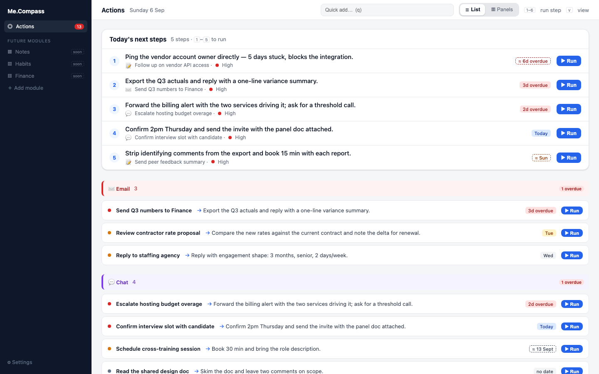

# Me.Compass — Personal Action Manager

A local, single-user tool that aggregates actions owed to the user from
Gmail, Google Drive/Gemini meeting notes, and Google Chat (plus manual
entry), flags what's overdue, and uses the local Claude Code CLI to infer
missing due dates/priority and suggest a next step per action.

Decisions: `docs/adr/` and `CHANGELOG.md` — read before proposing
architecture changes.

## Preview

The chosen dashboard design: a numbered "Today's next steps" list with a
per-item Run button, body grouped by source (Email/Chat/Meetings/Manual),
toggleable between this list view and a 2×2 panel view. Rendered from
`docs/preview/dashboard-preview.html` with fictional sample data — the
actual prototype this was chosen from used real content from research into
this project's own data sources and is git-ignored, not this file.

## Layout

- `backend/` — NestJS (Fastify adapter), `node:sqlite`
- `frontend/` — React + Vite
- `specs/001-personal-action-manager/` — spec, plan, tasks, data model, API
  contract, architecture diagram
- `docs/adr/` — architecture decision records
- `.specify/memory/constitution.md` — project principles

## Running it

See `specs/001-personal-action-manager/quickstart.md`. Needs a Google OAuth
client id/secret (`.env`, see `.env.example`) and `docker compose up --build`.
